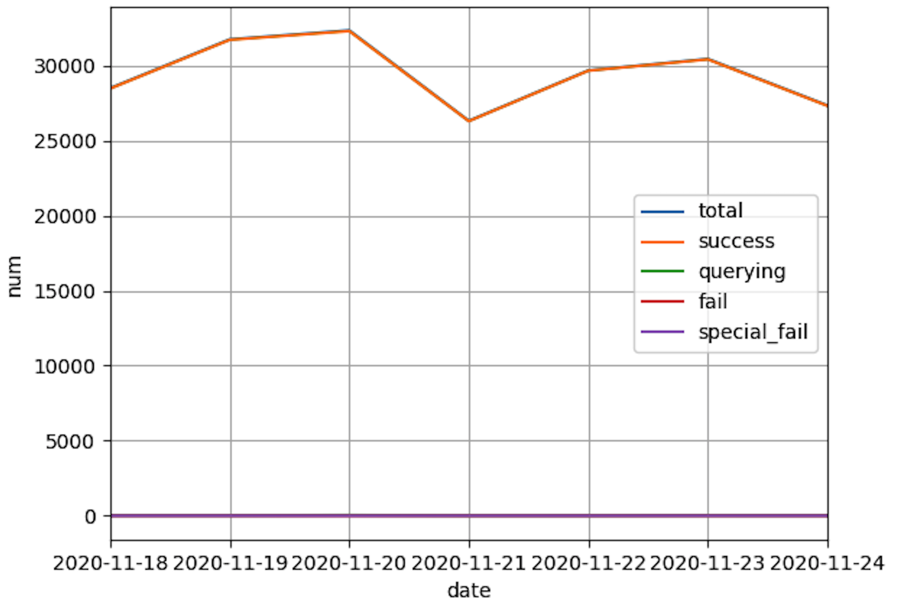
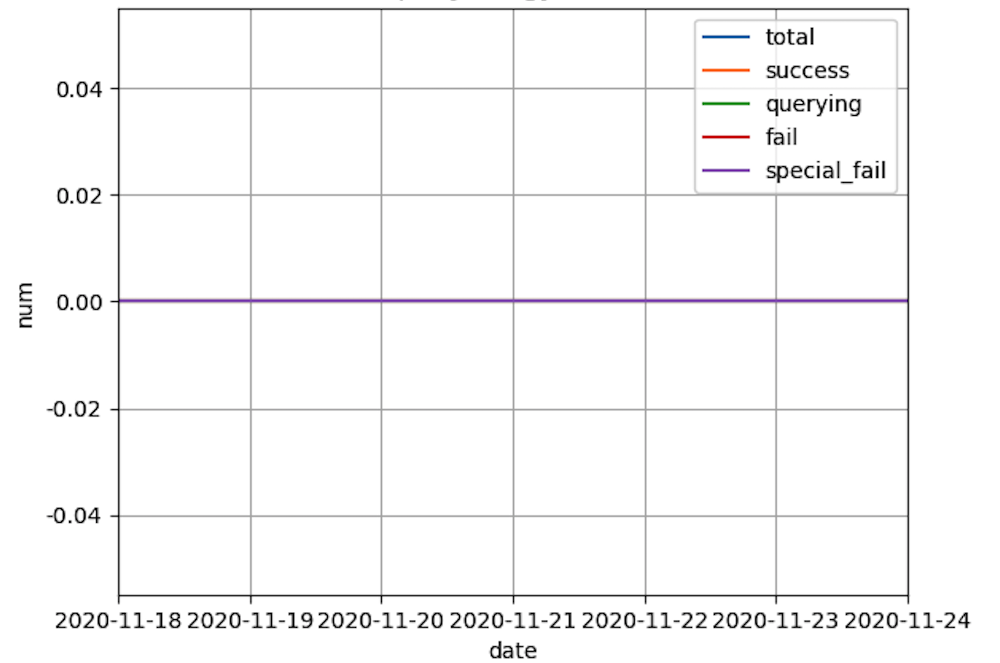
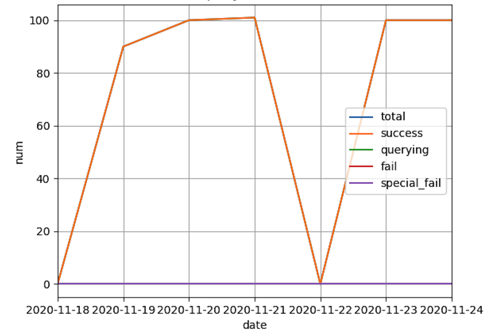
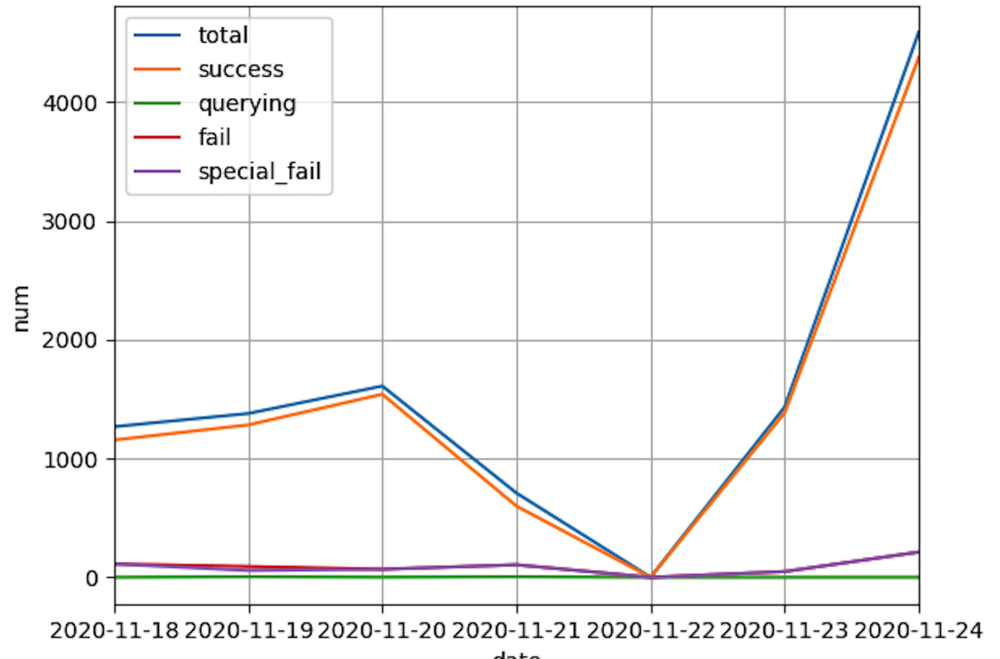
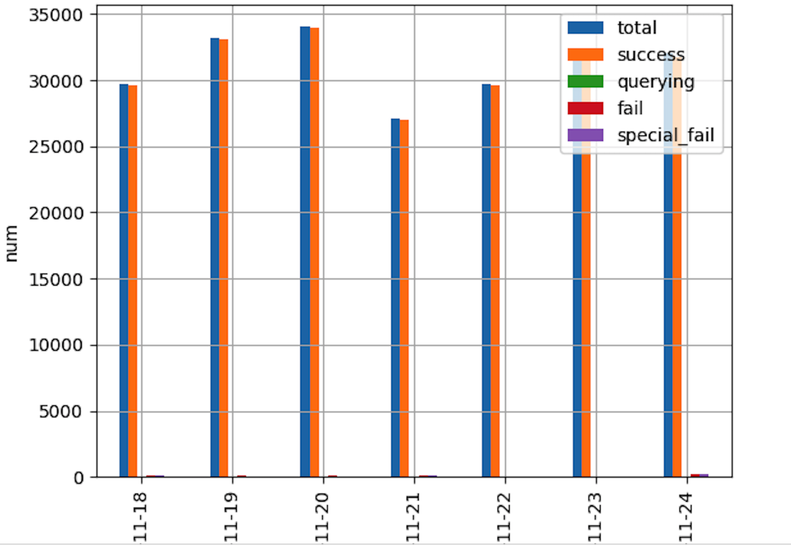
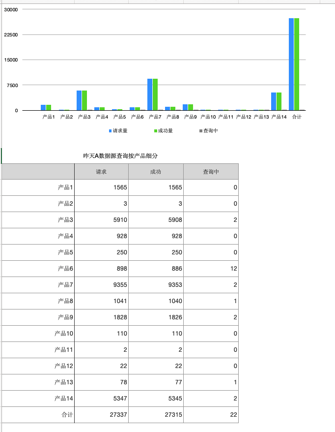

# dailyreport
generate daily report by python and send  email 
根据数据定时生成每日报表并发送邮件

开发日志: https://cgdeeplearn.github.io/2020/12/06/Daily-Report/

## 1. 获取数据

- 示例从db1/db2提取近几天或者前一天的数据，
- 并将数据转换成`numpy` data
    
## 2. pandas解析提取数据

- 根据数据性质和需要 利用pandas进行转换,生成基本的DataFrame或者时间序列
- 利用pandas清理冗余数据、填充缺失数据
- 对DataFrame 调整index和columns或者生成新的列或者多重索引

    
## 3. 分析汇总数据

- 利用pandas对DataFrame进行聚合分析
- 转换轴、聚合计算、汇总，生产数据
- 利用matplotlib对聚合汇总数据生成相应的图片(柱状图、折线图、饼图等)
    
## 4. 发送邮件

- 配置邮件格式、收发人、连接等
- 对分析汇总的数据、图片、附件填充到邮件
   
## 5. 配置定时任务

- 测试手动运行情况 (`python daily_report.py`)
- 配置crontab定时任务

## 6. 运行结果示例

### 6.1 A数据源清理提取分析后数据

- 表格

|日期| 数据源源 |日查询总量|查询成功量 |在查询中量 |查询失败总量|特殊失败量|
|-|-|-|-|-|-|-|
|2020-11-24	|A数据源|	27337|	27315|	22	|0|	0|
|2020-11-23 |A数据源|	30435|	30409|	25	|1|	1|
|2020-11-22 |A数据源|	29667|	29652|	15	|0|	0|
|2020-11-21	|A数据源|	26309|	26291|	17	|1|	1|
|2020-11-20	|A数据源|	32336|	32295|	41	|0|	0|
|2020-11-19	|A数据源|	31738|	31711|	25	|2|	2|
|2020-11-18	|A数据源|	28489|	28464|	24	|1|	1|

- 图片

### 6.2 B数据源清理提取分析后数据

- 表格

|日期| 数据源 |日查询总量|查询成功量 |在查询中量 |查询失败总量|特殊失败量|
|-|-|-|-|-|-|-|
|2020-11-24	|B数据源|	0|	0|	0	|0|	0|
|2020-11-23 |B数据源|	0|	0|	0	|0|	0|
|2020-11-22 |B数据源|	0|	0|	0	|0|	0|
|2020-11-21	|B数据源|	0|	0|	0	|0|	0|
|2020-11-20	|B数据源|	0|	0|	0	|0|	0|
|2020-11-19	|B数据源|	0|	0|	0	|0|	0|
|2020-11-18	|B数据源|	0|	0|	0	|0|	0|

- 图片

### 6.3 C数据源清理提取分析后数据

- 表格

|日期| 数据源 |日查询总量|查询成功量 |在查询中量 |查询失败总量|特殊失败量|
|-|-|-|-|-|-|-|
|2020-11-24	|C数据源|	100|100|	0	|0|	0|
|2020-11-23 |C数据源|	100|100|	0	|0|	0|
|2020-11-22 |C数据源|	0|	0|	0	|0|	0|
|2020-11-21	|C数据源|	0|	0|	0	|0|	0|
|2020-11-20	|C数据源|	101|0|	101	|0|	0|
|2020-11-19	|C数据源|	90|	90|	0	|0|	0|
|2020-11-18	|C数据源|	0|	0|	0	|0|	0|

- 图片

### 6.4 D数据源清理提取分析后数据

- 表格

|日期| 数据源 |日查询总量|查询成功量 |在查询中量 |查询失败总量|特殊失败量|
|-|-|-|-|-|-|-|
|2020-11-24	|D数据源|	4852|	4372|	0	|212|	212|
|2020-11-23 |D数据源|	1431|	1383|	0	|48|	48|
|2020-11-22 |D数据源|	0|	0|	0	|0|	0|
|2020-11-21	|D数据源|	709|	599|	5	|105|	105|
|2020-11-20	|D数据源|	1609|	1540|	1	|68|	67|
|2020-11-19	|D数据源|	1378|	1282|	5	|91|	57|
|2020-11-18	|D数据源|	1267|	1155|	0	|112|	112|

- 图片

### 6.5 汇总分析数据

### 6.6 昨日详情按产品细分

#### 6.6.1 A数据源示例

